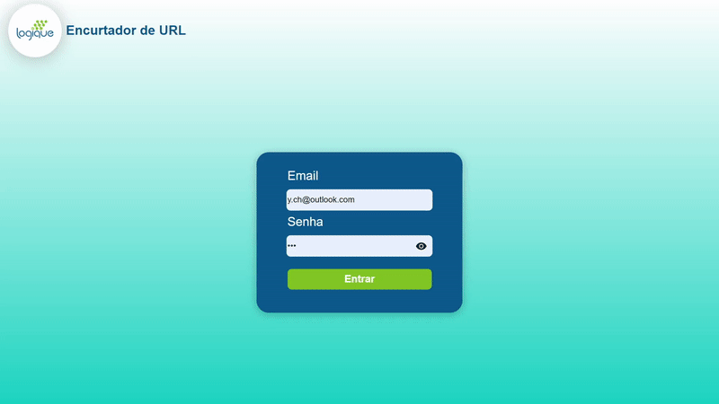

<h1 align="center">URL shortener🔗</h1>

  

  

 

<h1 align="center">Languages and Tools</h1>

 
 
 
 
 
 

 

<h1 align="center">Description</h1>

Project that was requested as a challenge for a junior developer job. 🚀

 

<h1 align="center">You can find me on the web</h1>

  
  

 

<h1 align="center">Show your support</h1>

If you liked it leave a ⭐

 

---

Sincerely: Yuri Christian (Namikoka).

